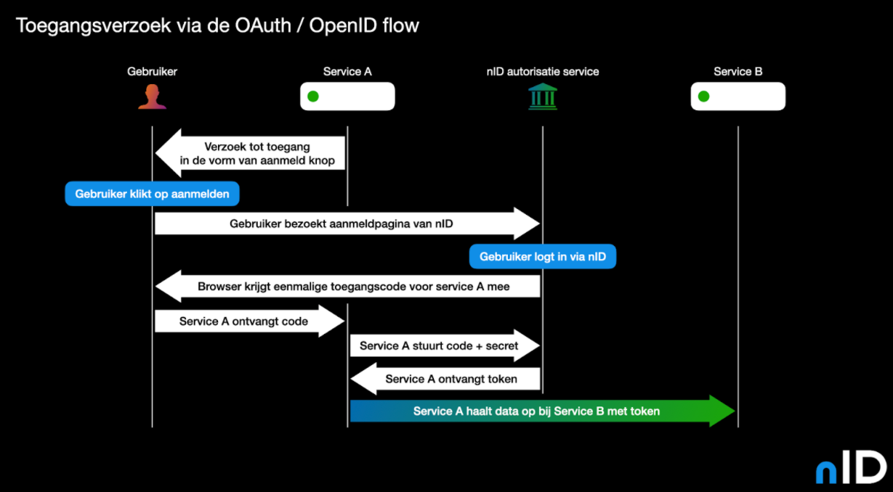

Autorisatie voor een afnemende partij om data op te halen van een burger gaat middels de [OAuth / OpenID](https://openid.net/connect/) flow. Service A van de afnemende partij toont een zogenaamde “Aanmelden met nID” knop op zijn website genaamd nID Button. Wanneer de burger hier op klikt wordt deze geredirect naar de aanmeldingspagina van nID. Hier wordt aan de burger getoond welke partij wat voor informatie wil ophalen. Indien de burger hiermee akkoord gaat, kan dit verzoek geaccepteerd worden door gebruik te maken van de nID Wallet App. Dit wordt gedaan door een getoonde QR code te scannen. Na het scannen heeft de burger de mogelijkheid om eventueel optionele data uit te vinken en indien hij of zij akkoord is vervolgens op accepteren te klikken. Vervolgens wordt de gebruiker terug gestuurd naar de server van de afnemende partij. Hiermee ontvangt de afnemende partij een autorisatie code. Deze autorisatie code kan in combinatie met de API key van de afnemende partij ingewisseld worden voor een [JWT](https://jwt.io/) token en een ge-encrypt pseudoniem voor de burger in kwestie. De pseudoniem kan door de afnemende partij gebruikt worden om meerdere data verzoeken over een persoon aan elkaar te relateren zonder dat daar een BSN voor nodig is. De JWT token kan gebruikt worden om de verzochte data over de burger op te halen in het platform.

Een afnemende partij kan informatie over het ophalen van data vinden in het dashboard wat momenteel bekend staat als [“Het Developers Portaal”](https://admin.twi.twi.n-id.network/login) en zal in dit document gerefereerd worden als zijnde dashboard.

<!--  -->

Controle op deze requests middels de JWT token wordt bewerkstelligt door envoy filters in de sidecars.
