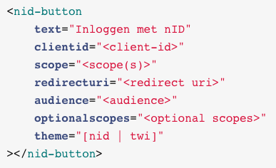

Een afnemende partij kan een data toegangsverzoek bewerkstelligen door gebruik te maken van de nID button. Deze is momenteel in twee thema’s beschikbaar, de originele nID button of de groene TWI button.

<!--  -->

De knop is beschikbaar als [web component](https://open-wc.org/) en te installeren in elk gewenst framework. De eerste versie is beschikbaar middels NPM onder pilotteam en zal uiteindelijk een officieel nID-button [npm registry](https://www.npmjs.com/package/@pilotteam/nid-button) krijgen.

<!--  -->

Het nID button web component heeft 7 attributen die gezet kunnen worden:

- **text**: De tekst die wordt weergeven in de button
- **clientid**: Het id van de afnemende partij bekend gemaakt tijdens de aanmeld flow van de afnemende partij
- **scopes**: een of meer scopes die aangeven wat voor informatie de afnemende partij graag wil ophalen. - De beschikbare scopes zijn in te zien in het dashboard
- **redirecturi**: de uri waar de burger naar wordt geredirect na het accepteren of afwijzen van het verzoek tot data
- **audience**: de service waaruit de data moet worden opgehaald
- **optionalscopes**: scopes die een afnemende partij als optioneel kan toevoegen. De burger heeft de keuze om deze scopes uit te zetten.
- **theme**: nID thema of twi thema
