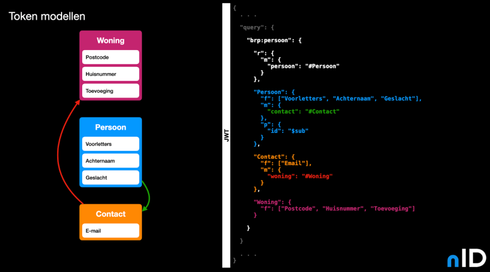
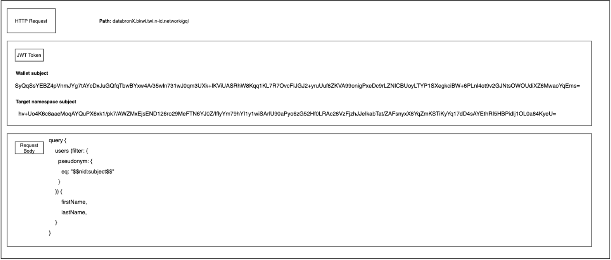

nID streeft ernaar om databronnen aan te laten sluiten middels een [GraphQL](https://graphql.org/) interface. Hierdoor wordt data minimalisatie gerealiseerd. Het is met nID mogelijk om vervolgens expliciet toegang te geven tot bepaalde velden in een GraphQL interface. Deze toegangs data wordt opgeslagen in de uitgeven JWT token en gecontroleerd door [envoy filters](https://www.envoyproxy.io/docs/envoy/latest/configuration/http/http_filters/http_filters). Met deze envoy filters is het mogelijk om gedrag te forceren op de netwerklaag van het platform voor alle services die aangesloten zijn, zonder dat er aan de service zelf iets veranderd hoeft te worden.

<!--  -->

Door het pseudonimisatie stelsel van nID is het ook niet meer nodig om een BSN of ander ID in de GraphQL query te zetten. Dit wordt ook middels envoy filters automatisch afgehandeld, zie pseudonimisatie.

Een abstracte weergave als voorbeeld voor een GraphQL request is weergeven in de afbeelding hieronder. De encrypted pseudoniemen worden bewaard in de JWT token. Merk hier ook op dat in de GraphQL query geen pseudoniem staat, maar slechts een variabele “$$nID:subject$$”. Deze variabele zal automatisch worden vervangen door het unencrypted pseudoniem in de target namespace middels een envoy filter.

<!--  -->
