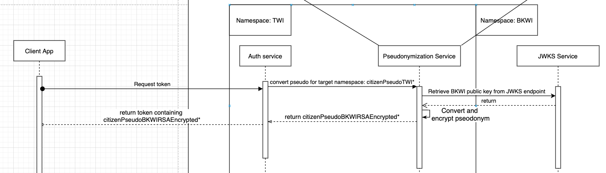
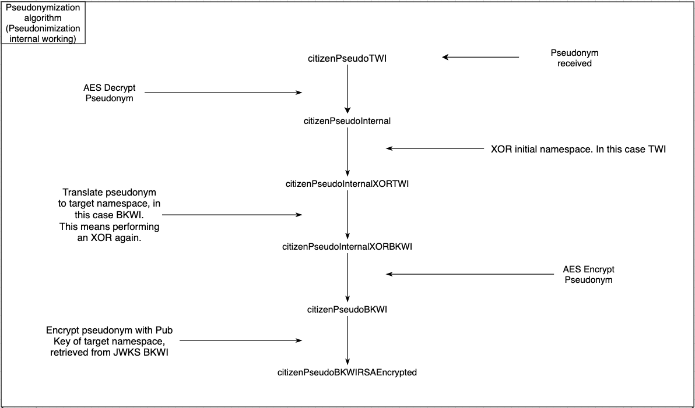
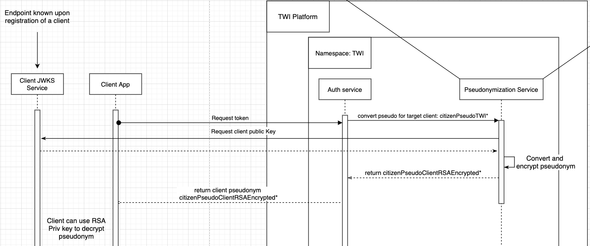
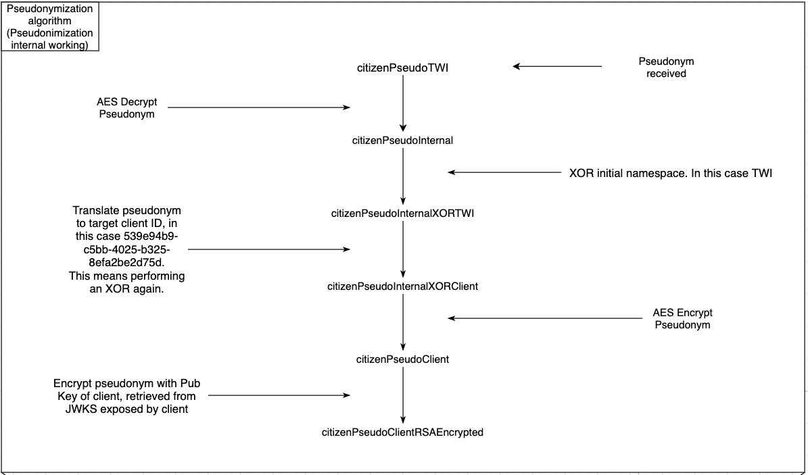

Pseudonimisatie zorgt er voor dat het platform geen gebruik hoeft te maken van BSN’s. In plaats daarvan worden er pseudoniemen tussen partijen gecommuniceerd.

Na authenticatie wordt voor elke burger een pseudoniem aangemaakt en opgeslagen in de wallet. Wanneer een afnemende partij informatie voor een burger wil ophalen wordt middels de autorisatie flow het initiële pseudoniem van de burger geconverteerd naar een pseudoniem wat wordt begrepen door de target databron welke bevraagd gaat worden door de afnemende partij.

<!--  -->

Services draaien in een namespace, in het bovenstaande voorbeeld hebben we een TWI en een BKWI namespace. Unencrypted pseudoniemen van een burger binnen een enkele namespace zijn gelijk, hierdoor is het mogelijk voor een partij om data over dezelfde persoon te relateren. Pseudoniemen worden over lijn RSA versleuteld verstuurd. Aangezien [RSA](<https://en.wikipedia.org/wiki/RSA_(cryptosystem)>) niet deterministisch is, is het onmogelijk om data over dezelfde burger te relateren wanneer derde de beschikking zouden hebben om netwerkverkeer af te luisteren. Oftewel het gecommuniceerde pseudoniem van een burger zal nooit twee keer hetzelfde zijn.

De werking van het algoritme voor het vertalen van pseudoniemen is in de onderstaande afbeelding weergeven. Het startpunt is het [AES](https://en.wikipedia.org/wiki/Advanced_Encryption_Standard) encrypted pseudoniem van een burger verkregen uit de wallet. Deze wordt middels AES ontsleuteld. Op het ontsleutelde pseudoniem wordt een (bit-wise) [XOR](https://en.wikipedia.org/wiki/XOR_gate) toegepast met de initiële namespace, in het onderstaande voorbeeld wordt hiervoor TWI gebruikt. Op het resulterende pseudoniem wordt nogmaals een XOR gedaan met de naam van de resulterende namespace, in dit geval BKWI. Dit pseudoniem is specifiek voor de BKWI namespace en zal alleen door deze namespace begrepen worden. Het resulterende pseudoniem wordt weer geencrypt met AES en vervolgens RSA versleuteld met de publieke key van de target namespace. Hierdoor is de resulterende pseudoniem niet deterministisch en kan deze alleen weer worden ontsleuteld middels de private sleutel die de BKWI namespace in zijn bezit heeft. De RSA versleutelde pseudoniem wordt in de JWT token gestopt die gebruikt kan worden om data over de persoon in kwestie op te halen.

<!--  -->

Pseudoniemen voor een afnemende partij werken met hetzelfde principe als pseudoniemen die gecommuniceerd worden naar databronnen. Tijdens de aansluitprocedure van een afnemende partij wordt een [JWKS](https://tools.ietf.org/html/rfc7517) endpoint geregistreerd, welke de publieke sleutel van de afnemende partij served.

<!--  -->

Dit endpoint kan geheel buiten het platform draaien in de omgeving van de afnemende partij. In de onderstaande afbeelding is het algoritme beschreven om een pseudoniem te maken voor een afnemende partij. De werking verschilt op 1 punt met die van pseudoniemen converteren voor een databron. In plaats van de target namespace, wordt het id van de client gebruikt om het pseudoniem te converteren. Het resulterende RSA encrypted pseudoniem kan door de afnemende partij worden ontsleuteld met hun private RSA sleutel.

<!--  -->
