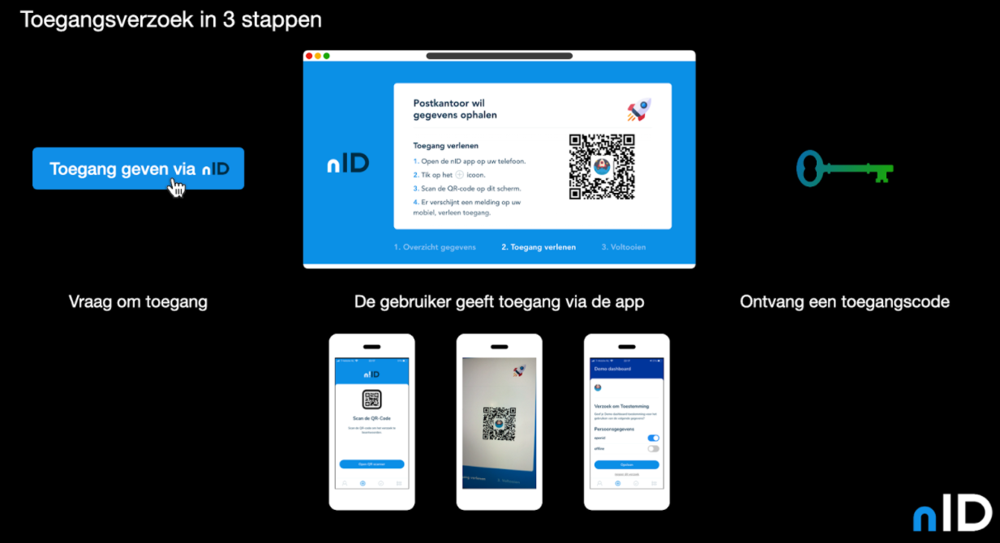

Vanuit de oplossing nID, wordt de wallet gebruikt. De Wallet heeft als doel om burger inzicht en controle te geven over zijn of haar data. Middels een eIDAS middel(mogelijk DigiD) kan een burger zich aanmelden in de wallet. Hiermee wordt de burger geauthentiseerd op het platform en kan hij of zij, na authenticatie, middels deze wallet toestemming geven of intrekken voor het verstrekken van data. Omdat het eIDAS middel nog niet is aangesloten in PI1 zullen er vooralsnog enkel burgers handmatig worden aangesloten die daarvoor toestemming hebben gegeven.

Verder wordt er in de wallet een overzicht getoond aan de burger aan wie hij of zij recht heeft gegeven om zijn of haar data op te mogen halen. Daarnaast kan in de wallet ook bekeken worden welke data verschillende partijen daadwerkelijk hebben opgevraagd over de burger.

De wallet is geïmplementeerd als app en kan geïnstalleerd worden op een mobiele telefoon. Na registratie worden secrets van de burger opgeslagen in de secure storage van de telefoon. Hiermee kan de wallet dus vergeleken worden met een mobiel bankieren app, maar in plaats van het autoriseren van geldtransacties verzorgd de app data transacties.

<!--  -->
