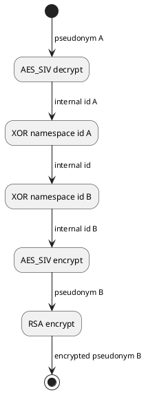

# Pseudonymization

This document describes the technical details regarding how the pseudonymization component generates pseudonyms and translates them to one another.

### Design goals
- It should be impossible to translate one psuedonym to another outside of the pseudonymization service.
- It should be easy for the pseudonymization service to translate one pseudonym to another.
- The pseudonymization service should be stateless (no rainbow tables).
- It should be possible for a third party to keep track of a pseudonym without knowing it.


### Definitons

##### internal id
The unique identifier for a user is the **internal id**, a string of 256 bits. This is generated when a user joins the cluster, and encrypted to form the first pseudonym.

##### internal id A
Users also have an internal id for each namespace (henceforth **internal id A** for namespace **A**). This is derived from a combination of the user's **internal id** and the namespace's **namespace id** (XOR in practice).

Note that *only* the __pseudonymization__ service has access to internal id's, both the general one and the namespace's one, since they are meant to be easily converted to one another. The pseudonymization service does _not_ keep track of these id's but only processes them when a request is made. This service is _entirely stateless_.

##### pseudonym A
The identifier for a user within a single namespace is a **pseudonym**. For a namespace A, **pseudonym A** is an AES_SIV encrypted form of **internal id A**. These pseudonyms are meant to be _practically impossible_ to translate to one another without using the pseudonymization service.

##### encrypted pseudonym A
Still, **pseudonym A** is sensitive information outside of namespace **A**. However, there are many use cases where someone outside of that namespace may want to keep track of such a pseudonym. For example in a JWT token that grants access to a data source in namespace **A**. Therefore, we often encrypt these **pseudonyms** an extra time, using RSA encryption. The result of encrypting **pseudonym A** using namespace **A**'s RSA public key is called an **encrypted pseudonym**.

In short:

- **internal id** = 256 random bits
- **internal id A** = _XOR_(internal id, namespace id A)
- **pseudonym A** = _AES\_SIV_(internal id A)
- **encrypted pseudonym A** = _AES\_SIV_(internal id A)

### Pseudonym generation
```plantuml
(*) -down> Generate internal id A<sup>1</sup>
-down>[ internal id A] AES_SIV encrypt
-down>[ pseudonym A] RSA encrypt
-down>[ encrypted pseudonym A] (*)
```

<sup>1. Note that due to the reversible nature of XOR we can simply generate **internal id A** and assume that the **internal id** is XOR(**internal id A**, **namespace id A**)</sup>

### Pseudonym conversion


