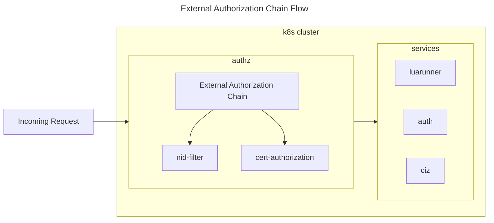

# External Authorization Chain

External Authorization (ext-authz-chain) can be used to apply multiple external authorization services for a single host in the cluster.

## Requirements

### config
A file must exist in config folder: `config/endpoints.yaml`

Content example:
```yaml
deny_by_default:
  enabled: true
  # [] could also be empty. This means that only the hosts below (at endpoints) are whitelisted for the cluster.
  allow:
    - another-service.nid.domain.com
endpoints:
  cert-authorization.nid.svc.cluster.local:80:
    - luarunner.nid.domain.com
    - auth.nid.domain.com
    - ciz.vecozo.domain.com
  nid-filter.nid.svc.cluster.local:80:
    - ciz.vecozo.domain.com
```

The syntax is: `endpoints: map[string]string[]`

Adding this file can be done through a volume mount. See [Example](#k8s-configmap)

## Flow




### K8s ConfigMap
```yaml
apiVersion: v1
kind: ConfigMap
metadata:
  name: authorization-endpoints
  namespace: nid
data:
  endpoints.yaml: |
    deny_by_default:
      enabled: true
      # allow: [] could also be empty. This means that only the hosts below (at endpoints) are whitelisted for
      # the cluster if enabled is set to true.
      allow:
        - another-service.nid.domain.com
    endpoints:
      cert-authorization.nid.svc.cluster.local:80:
        - luarunner.nid.domain.com
        - auth.nid.domain.com
        - ciz.vecozo.domain.com
      nid-filter.nid.svc.cluster.local:80:
        - ciz.vecozo.domain.com
```
